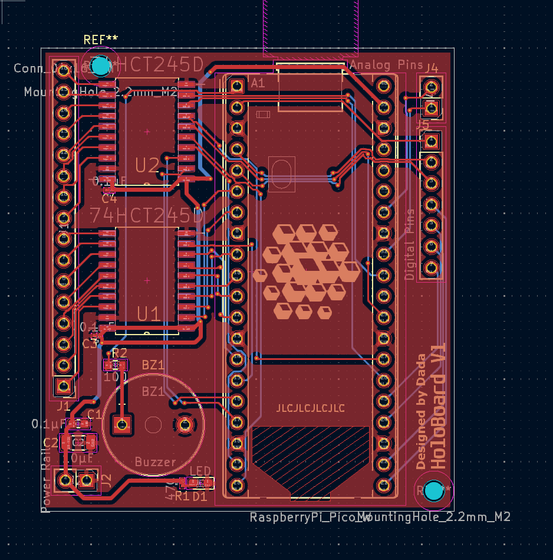

# **Holocub V2 – 16×16×16 RGB LED Cube**

  
*A fully addressable 3D LED display for animations, games, and visual effects.*

---

## 📜 Overview
Holocub V2 is a large-scale **16×16×16 RGB LED cube** (4096 voxels total) built with WS2812B addressable LEDs.  
It is designed to display dynamic animations, interactive effects, and data visualizations in 3D.

The cube is controlled by a microcontroller (planned: **RPi Pico 2W / other capable MCU**) and supports both **procedural animations** and **pre-rendered frames** loaded from an SD card.

---

## 🔧 Hardware Specifications

| Component                     | Specification |
|--------------------------------|---------------|
| **Cube Size**                 | 16 × 16 × 16 voxels |
| **Total LEDs**                | 4096 WS2812B RGB LEDs |
| **LED Type**                  | WS2812B (5V, individually addressable) |
| **PSUs**                      | 4 × [insert voltage/current rating] |
| **Data Lines**                | One per 8×8×16 “tower” (4 total) |
| **LED Strip Arrangement**     | Snake layout per layer (serpentine wiring) |
| **MCU**                       | Raspberry Pi Pico 2W (planned) / ATTINY88 |
| **Storage**                   | MicroSD card (frame/animation storage) |
| **Power Injection**           | Multiple injection points per strip |
| **Estimated Max Power**       | ~1.23 kW at full white (theoretical max) |

---

# HoloBoard – PCB by Dragoș

**Short description**  
HoloBoard is a custom PCB designed for the Holocub project, acting as the main control and interface board.  
It hosts a Raspberry Pi Pico 2W, integrates a piezo buzzer, and features two bidirectional logic-level shifters for safe communication between 3.3V and 5V components.

## 🔧 Key Features
- **MCU Slot:** Raspberry Pi Pico 2W header footprint (solder-in or socket).
- **Audio Output:** 1 × piezo buzzer connector (with optional series resistor).
- **Level Shifting:** 2 × bidirectional level shifter circuits (BSS138 + pull-ups) for 3.3V ↔ 5V I²C/UART/peripherals.
- **Power Control:** Power selector header (3.3V / 5V) with decoupling capacitors.
- **Connectivity:** I²C SDA / SCL breakout to convenient pads + screw terminals.
- **Build Quality:** Silk labels for pins, test pads, and mounting holes.

## 📦 Minimal BOM
- 1 × RP2040 (Pico 2W) socket / header footprint
- Headers, pads, mounting hardware
- Yet to add more info

---

## 📜 Schematics & Photos

### **Schematic – Level Shifter**
  
*Figure 1 — The HoloBoard schematic in KeyCad.*

### **Schematic – Power & Buzzer**
  
*Figure 2 — components used, I/O's, connections.*

### **Photo – Assembled (Front)**
  
*Figure 3 — Front view, Pico 2W inserted.*

### **Photo – Assembled (Back / Solder Side)**
  
*Figure 4 — Back view showing soldering and Logo.*

---

## 🚀 Features
- **Scalable architecture** – animations work on both 4×4×4 test cube and full 16×16×16 cube.
- **Voxel-based rendering** – uses a global `voxelMatrix[x][y][z]` buffer for color control.
- **Procedural animations** – gradients, bouncing “DVD logo” effect, rain simulation, waves.
- **Pre-rendered playback** – read animations stored in `.vox` or custom binary format.
- **Custom GFX library** – draw lines, planes, waves, text in 3D space.
- **SD card support** – load animations without reflashing firmware.
- **Multi-PSU design** – independent PSU per cube tower for stable power delivery.

---

## ⚡ Power & Safety Notes
- WS2812B LEDs consume up to **60 mA per LED** at full brightness (white).
- Theoretical maximum current: **~245 A total** across 4 PSUs.
- Always fuse PSU outputs and use thick wiring for high-current paths.
- Avoid running full white at 100% brightness for prolonged periods to reduce heat.

---

## 🖥️ Software Workflow
### **Procedural animations**
- Written in C++ inside `/animations`
- Rendered directly to `voxelMatrix`
- Useful for dynamic effects and parameterized visuals

### **Pre-rendered animations**
- Created in Paint, MagicaVoxel, or similar tools
- Exported as `.bmp` or custom `.hca` (Holocub Animation) binary format
- Loaded via SD card at runtime

---

## 📸 Development Timeline
- **Phase 1** – Test code, Custom PCB `HoloBoard`, SD card reader on 4×4×4 cube ✅
- **Phase 2** – Develop GFX & cube configuration libraries ✅
- **Phase 3** – Build cube structure & solder all LED strips 🔄
- **Phase 4** – Integrate procedural + SD-based playback
- **Phase 5** – Optimize power, stability, and animation library

---

## 🛠️ Setup & Build
### **Dependencies**
- [Adafruit NeoPixel](https://github.com/adafruit/Adafruit_NeoPixel)
- SD card library for chosen MCU
- C++17 compatible toolchain
- PlatformIO (recommended) or Arduino IDE

### **Compilation**
```bash
# PlatformIO
pio run --target upload
```

### **Arduino IDE**
- Install Adafruit NeoPixel library
- Select **Raspberry Pi Pico 2W** (or your MCU)
- Upload `src/main.ino`

---

## 📄 License
[MIT License](LICENSE) – You are free to use, modify, and distribute this project with attribution.

---

## 🙌 Credits
- **Core team:** [Bernea Dragoș Dada & Teodosiu Radu]
- **Special thanks:** MaltWiskey (inspiration & reference designs), Adafruit (NeoPixel library) and The C++ GODS.
- **Open Source software's used for the cube and the animations:** MagicaVoxel(3D sprite's designer)
